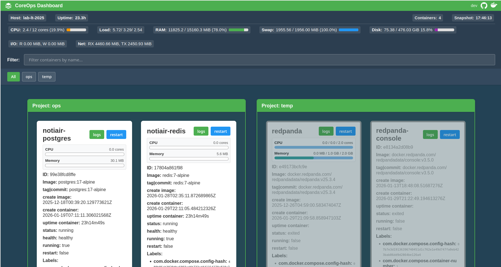
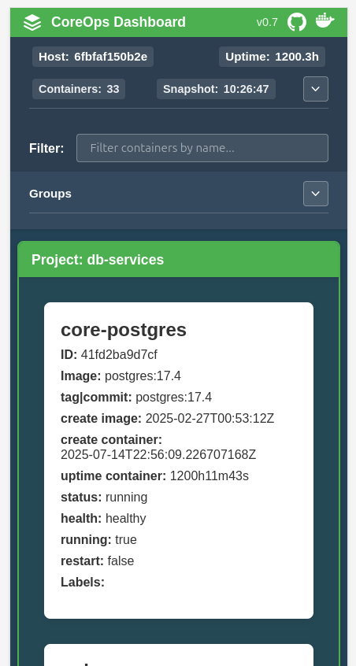

# Docker Dashboard





## Description

**Docker Dashboard** (CoreOps Dashboard) is a modern web interface for real-time monitoring of Docker containers and system metrics. The project provides a comprehensive view of running containers, their status, system resources, and allows viewing container logs in real-time.

## Features

### Container Management
- View all Docker containers (running and stopped)
- Display detailed container information:
  - Name, ID (short), Image, Tags/Commits
  - Creation time (image and container)
  - Uptime, Status, Health status
  - Restart count, Labels
- **Grouping by Docker Compose projects** - containers are automatically grouped by their compose project
- **Filter containers by name** - real-time search functionality
- **Filter by project groups** - quick access to specific compose projects
- **Real-time container logs** - view container logs in a modal window with auto-scroll support
- **Container restart** - restart containers directly from the UI (requires `CONTAINER_RESTART=true`)
- Visual indicators for unhealthy and stopped containers

### System Metrics
- **Host information**: hostname, uptime
- **CPU usage** with visual progress bar
- **System load** (1min, 5min, 15min)
- **Memory usage** (RAM and Swap) with progress indicators
- **Disk usage** across all mount points with I/O statistics
- **Network I/O** statistics (RX/TX)
- **Container count** and snapshot time

### Real-time Updates
- **WebSocket-based updates** - data refreshes every second automatically
- No manual refresh needed
- Automatic reconnection on connection loss

## Architecture

- **Backend (Go):**
  - REST API endpoints for containers and host info
  - WebSocket endpoints for real-time updates:
    - `/ws/containers` - container list updates
    - `/ws/hostinfo` - system metrics updates
    - `/ws/containers/{id}/logs` - container logs stream
  - Direct Docker API integration via HTTP client (no external library)
  - Serves static frontend files
- **Frontend (Svelte):**
  - Modern SPA built with Svelte 4 and Vite
  - WebSocket connections for real-time data
  - Responsive design with fixed header and metrics bar
  - Modal windows for log viewing

## Quick Start

### Requirements
- Docker
- Docker Compose (optional)
- Linux (recommended, requires access to `/var/run/docker.sock`)
- Go 1.23+ (for local development)
- Bun or Node.js (for frontend development)

### Using Docker (Recommended)

#### Build Docker Image

```sh
docker build . -t docker-dashboard:latest -f build/Dockerfile
```

Or use Makefile:

```sh
make docker-build
```

#### Run Container

```sh
docker run -it --publish 8080:8080 \
  -v /var/run/docker.sock:/var/run/docker.sock:ro \
  docker-dashboard:latest
```

#### Run with Docker Compose

Create a `compose.yml` file:

```yaml
services:
  docker_status:
    image: avt0x/docker-dashboard:latest
    container_name: docker-dashboard
    ports:
      - "8080:8080"
    volumes:
      - /var/run/docker.sock:/var/run/docker.sock:ro
    environment:
      - PORT=8080
      - LOGS_SHOW=true
      - CONTAINER_RESTART=true
      - LABEL_PREFIX=org.example
    restart: always
```

Then run:

```sh
docker-compose up -d
```

Or use Makefile:

```sh
make docker-run
```

### Local Development

#### Install Dependencies

```sh
make install
```

#### Run in Development Mode

This will start both frontend (Vite dev server) and backend:

```sh
make dev
```

- Frontend: http://localhost:5173
- Backend: http://localhost:8080

#### Build for Production

```sh
make build
```

#### Run Production Build

```sh
make run
```

### Access the Dashboard

Open your browser: [http://localhost:8080](http://localhost:8080)

## Environment Variables

- `PORT` — server port (default: `8080`)
- `LABEL_PREFIX` — show only container labels with this prefix (e.g., `org.example`)
- `LABEL_PREFIX_EXCLUDE` — show all labels except those with this prefix
- `LOGS_SHOW` — enable/disable logs button in UI (`true`/`false`, default: `false`)
- `CONTAINER_RESTART` — enable/disable container restart button in UI (`true`/`false`, default: `false`)
- `DEBUG` — enable debug logging (`true`/`false`, default: `false`)

## API Endpoints

### REST API
- `GET /api/containers` — get a list of containers with detailed information
- `GET /api/hostinfo` — get system metrics (CPU, RAM, Disk, Network, etc.)

### WebSocket Endpoints
- `WS /ws/containers` — real-time container list updates (updates every 1 second)
- `WS /ws/hostinfo` — real-time system metrics updates (updates every 1 second)
- `WS /ws/containers/{id}/logs` — stream container logs in real-time
- `WS /ws/containers/{id}/restart` — restart a container (requires `CONTAINER_RESTART=true`)

## Dependencies

### Backend
- Go 1.23+
- [github.com/gorilla/mux](https://github.com/gorilla/mux) - HTTP router
- [github.com/gorilla/websocket](https://github.com/gorilla/websocket) - WebSocket support
- [github.com/shirou/gopsutil/v4](https://github.com/shirou/gopsutil) - System metrics collection

### Frontend
- [Svelte](https://svelte.dev/) 4.x - UI framework
- [Vite](https://vitejs.dev/) 5.x - Build tool and dev server
- [Bun](https://bun.sh/) - Package manager and runtime (or Node.js)

**Note:** The project uses direct HTTP client to Docker API (via `/var/run/docker.sock`), not go-dockerclient library.

## Development

### Project Structure

```
docker-dashboard/
├── cmd/server/          # Backend entry point
├── internal/
│   ├── api/             # API handlers and WebSocket endpoints
│   ├── containers/      # Container data fetching logic
│   └── hostinfo/        # System metrics collection
├── web/                 # Frontend application
│   ├── src/
│   │   └── App.svelte   # Main Svelte component
│   └── public/          # Static assets
├── build/               # Docker build files
└── compose.yml          # Docker Compose configuration
```

### Available Make Commands

Run `make help` to see all available commands:

- `make install` - Install all dependencies
- `make dev` - Run in development mode (frontend + backend)
- `make build` - Build for production
- `make run` - Run production build
- `make docker-build` - Build Docker image
- `make docker-run` - Start with Docker Compose
- `make docker-stop` - Stop Docker Compose
- `make clean` - Clean build artifacts

## License

MIT 
