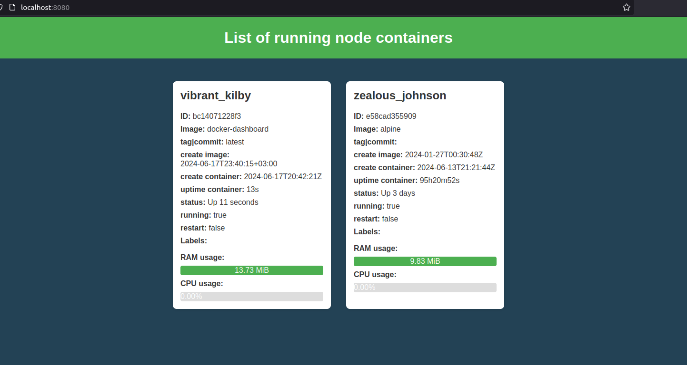

# Docker Dashboard

A simple monitoring dashboard for Docker.



## Build image


```docker build . -t docker-dashboard:latest -f build/Dockerfile```

## Run container

```docker run -it --publish 8080:8080 -v /var/run/docker.sock:/var/run/docker.sock:ro docker-dashboard:latest```

## Access dashboard

Open your browser and go to `http://localhost:8080`

